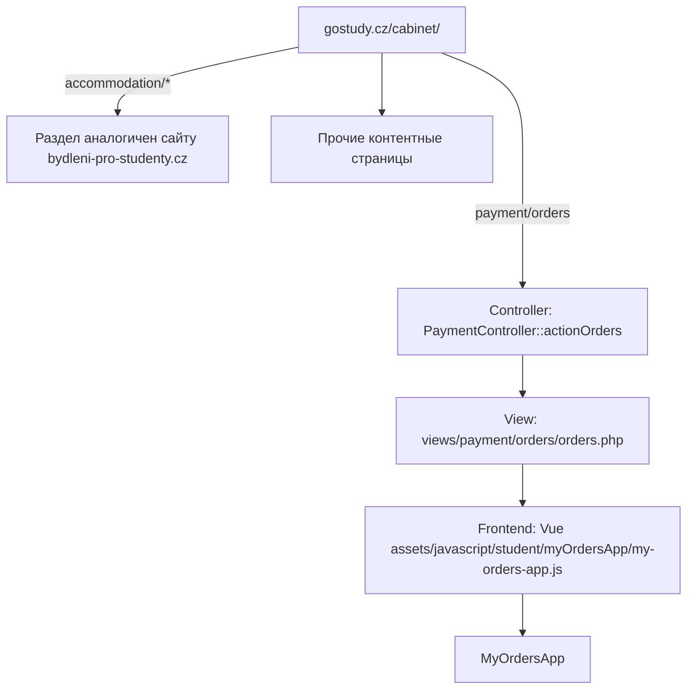
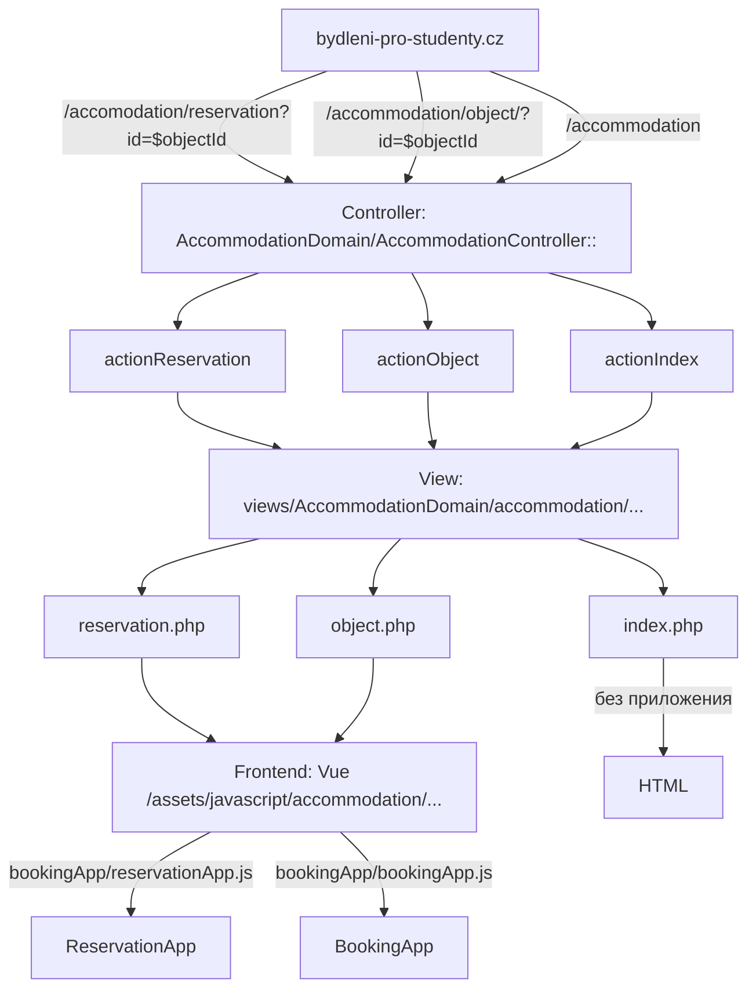

# Описание процесса оплат сайта gostydy.cz<br> bydleni-pro-studenty.cz, startsale.cz

## Понятия и определения
- ***Проект*** - проект Gostudy целиком, включая все его домены и функционал.
- ***Система оплат*** - общая мультисайтовая система-обработчик оплат, реализованная в коде репозитория [gostudy-studentscab](https://bitbucket.org/gsdevel/gostudy-studentscab), включающая в себя вывод товаров и услуг, доступных для покупки, механики их заказа, регистрация/валидация данных пользователей и взаимодействие с CRM.
- ***Платёжный шлюз, платёжная система*** - банковский сервис, где происходит ввод клиентом данных платёжной карты, обработка необходимых для оплаты данных клиента и непосредственно оплата.
- ***Личный кабинет*** - часть Системы оплат, реализующая Личный кабинет студента в разделе сайта gostydy.cz/cabinet
- ***CRM***  проекта - система CRM Битрикс24, используемая в прокте для хранения товаров и услуг, доступных для покупки, частичного хранения данных клиентов, ведения взаимодействия с ними, в том числе для формирования и фиксации оплат.
- ***Фронтенд*** проекта - часть Системы оплат, реализованная на Vue.js и отвечающая за интеракивное взаимодействие с пользователем в браузере, взаимодействующая с Бэкендом [по API](https://app.swaggerhub.com/apis/phoenixtf/Gostudy/1.0.0).
- ***Бэкенд*** проекта - часть Системы оплат, реализованная на PHP-фреймворке Yii (1-я версия, PHP 7.4, MySQL (Percona) 5.7), реализуюшая взаимодействие с Фронтендом и CRM, выполняющая непосредственное формирование данных для отправки на Платёжный шлюз, получения статуса платежей, и инициирующая фиксацию оплат в CRM.

## Принцип запуска проекта и работа с разными хостами
Проект использует три домена для проведения оплат:
- **gostudy.cz** - основной сайт с Личным кабинетом (раздел */cabinet/*). Сам сайт - контентный на Wordpress, раздел */cabinet/* обрабатывается отдельно и направлен на Систему оплат, закрыт авторизацией, все платёжные операции проходят внутри раздела.
> Как именно устроен роутинг раздела - см. конфигурацию Nginx на продакшне
- **bydleni-pro-studenty.cz** - сайт направлен напрямую на Систему оплат, которая формирует его контент из данных CRM.
- **startsale.cz** - контентный сайт, в контексте оплат использующийся только для привязки отдельного платёжного профиля и проксирования через него данных платежей.

К каждому из них привязан свой платёжный профиль (merchantNumber) в платёжной системе [GP webpay](https://www.gpwebpay.cz/).

Указанные домены направлены на общий сервер Nginx, который с помощью fastcgi-параметра *(какой именно - см. продакшн)* определяет в каждой директиве *server* для каждого домена, какой *environment* будет использоваться.
> пример с продакшна

В соответствии с каждым доменом используется три варианта *environment* и соотвествующее расположение конфигураций:
- `production` (gostudy.cz/cabinet) -  папка `protected/config/production`
- `accommodation` (bydleni-pro-studenty.cz) - папка `protected/config/accommodation_prod`
- `insurance` (startsale.cz) - папка `protected/config/insurance_prod`


## <a name="mainDomain"></a>Основной вариант платежей - через кабинет сайта gostudy.cz/cabinet
Используется ключевое слово **main**
MerchantNumber - 9675210009
Юрлицо - **Go Study group jazyková škola s právem státní jazykové zkoušky s.r.o.**

### Формирование списка объектов для оплаты &mdash; фронтенд
Список объектов для оплаты формирует фронтенд-приложение.

Путь запуска:

Приложение **MyOrdersApp** запрашивает большой массив данных по авторизованному клиенту:
https://app.swaggerhub.com/apis-docs/phoenixtf/Gostudy/1.0.0#/jsapi/get_payment_getOrdersData
```
Request URL: https://www.gostudy.cz/cabinet/payment/getOrdersData
Request Method: GET
```
В ответ получает порядка 1.5Мб данных для отображения (см. пример ответа).
Приложение отображает статусы оплаты позиций - Счетов и Платёжных обязательств.

## <a name="accommodationDomain"></a>Второй вариант - оплата Бронирования на сайте bydleni-pro-studenty.cz

Используется ключевое слово *Accommodation*.
MerchantNumber - 13850888
Юрлицо - **START Capital Partners s.r.o.**

Сайт полностью формируется из Системы оплат.

### Фронтенд
На сайте **bydleni-pro-studenty.cz** также используется фронтенд-приложение.
Путь запуска:


К оплате доступны следующие объекты:
- Бронирование


$paymentId
$orderId

## <a name="insuranceDomain"></a>Использование сайта startsale.cz
Сайт **startsale.cz** используется только для разделения мерчантов при оплате Страховок - данные для платёжной формы оплаты Страховок формируются на основном сайте *Production*, пересылаются на соответствующий контроллер сайта, собирающий форму, данные которой перенаправляются на платёжный шлюз. Обработка результата происходит 

Используется ключевое слово *Insurance*.
*MerchantNumber* - 532170002
Юрлицо - **START Insurance s.r.o.**

К оплате доступны следующие объекты (формируется на сайте *Production*):
- Страховка
- Перевод

## Оплата Счетов

1. Сайт *Production* - раздел `/payments/orders/`
2. 

## Оплата Дополнительных платёжных обязательств

### `\PaymentController::actionMakeObligationPayment`


Тип платежа определяется по свойству объекта `$payment->creditor`
```
$gpProfileName = PaymentService::CREDITORS_AS_GP_WEBPAY_PROFILES[$payment->creditor] ?? null;
...
```
Возможные значения:
```
// Reference: \application\libraries\services\PaymentService
// payment profiles  
public const GP_PROFILE_NAME_MAIN = 'main';  
public const GP_PROFILE_NAME_ACCOMMODATION = 'accommodation';  
public const GP_PROFILE_NAME_INSURANCE = 'insurance';
```
Возможные ключи значений (определены в CRM):
```
// Reference: \application\libraries\services\PaymentService
// creaditors  
public const CREDITOR_GOSTUDY = '19674';  
public const CREDITOR_START_CAP = '19675';  
public const CREDITOR_START_INSURANCE = '19676';
```
Связи ключей и имён платёжных профилей:
```
// Reference: \application\libraries\services\PaymentService
// creditors are elements of list  
public const CREDITORS_AS_GP_WEBPAY_PROFILES = [  
	self::CREDITOR_GOSTUDY => self::GP_PROFILE_NAME_MAIN,  
	self::CREDITOR_START_CAP => self::GP_PROFILE_NAME_ACCOMMODATION,  
	self::CREDITOR_START_INSURANCE => self::GP_PROFILE_NAME_INSURANCE,  
];
```
Исходя из значения `$gpProfileName` происходит либо редирект на соответствующий домен (с соответствующей типу платежа привязкой платёжного профиля - соотв. имена профилей `accommodation` и `insurance`), либо прямое формирование формы оплаты с последующим HTML-редиректом на платёжный шлюз.

### Формирование платёжной формы

Инициализируется платёжный профиль в соответствии с полученным именем:
```
$gpProfile = new GPWebpayProfile($gpProfileName);
```
Формируется объект формы на основе параметров:
- `$payment` - объекта платежа
- `$gpProfile` - объекта платёжного профиля
- `$redirectUrl` - абсолютный URL, на который платёжный шлюз отправит ответ (определяется исходя из типа платёжного профиля)
- `$cabinetUserId` - ID пользователя Системы оплат *(соотв. единый для всех сайтов)*

И вывод формы:
```
$paymentForm = $paymentService->createObligationPaymentForm($payment, $gpProfile, $redirectUrl, $cabinetUserId);

$renderData = [  
  'redirectUrl' => $gpProfile->getApiUrl(), // URL 
  'paymentForm' => $paymentForm,  
];  
... 
$this->render('payment_redirect_form', $renderData);
```

Форма автоматически отправляется js-скриптом.

## Примеры оплат различных товаров

| Название                                                           | Тип                            | categoryCode  | URL после кнопки (контроллер) | Параметры                            | Ответ | Переход                                               | Доп.параметры | Результирующий URL                     |
|--------------------------------------------------------------------|--------------------------------|---------------|-------------------------------|--------------------------------------|-------|-------------------------------------------------------|---------------|----------------------------------------|
| **PRODUCTION** gostudy.cz/cabinet                                      |                                |               |                               |                                      |       |                                                       |               |                                        |
| Годовой курс «Онлайн + Прага». Премиум. С 1 сентября 2022          | Счёт                           | -             | payment/payinvoices           | deal_id=27525, id[]=121464           | 200   | -                                                     | -             | payment/paymentresult                  |
| Счёт на оплату                                                     | Счёт                           | -             | payment/payinvoices           | deal_id=27525, id[]=124882           | 200   |                                                       | -             | payment/paymentresult                  |
| Госпошлина за нострификацию среднего образования (счет 202235189)  | Другие платежные обязательства | service       | payment/makeObligationPayment | paymentId                            | 200   |                                                       | -             |                                        |
| Перевод документов на чешский язык (2 листа) (счет 202235190)      | Другие платежные обязательства | service       | payment/makeObligationPayment | paymentId                            | 302   | bydleni-pro-studenty.cz/payment/makeObligationPayment | cabinetUserId | bydleni-pro-studenty.cz/payment/result |
| Страховка PVZP на 7 месяцев                                        | Другие платежные обязательства | medical       | payment/makeObligationPayment | paymentId                            | 200   | JS form submit                                        |               | payment/obligationPaymentResult        |
| Комплексная страховка MAXIMA на 12 месяцев                         | Другие платежные обязательства | medical       | payment/makeObligationPayment | paymentId                            | 302   | startsale.cz/payment/makeObligationPayment            | cabinetUserId | startsale.cz/payment/result            |
| Standart. Трехместная комната со всеми удобствами (счет 202238560) | Другие платежные обязательства | service       | payment/makeObligationPayment | paymentId                            | 200   | JS form submit                                        |               | payment/obligationPaymentResult        |
| **ACCOMMODATION**  bydleni-pro-studenty.cz                             |                                |               |                               |                                      |       |                                                       |               |                                        |
| Мое бронирование №1553937 - Общежитие Siesta Bratislava            | Бронирование                   | accommodation | accommodation/payinvoices     | invoiceIds, reservationId, contactId |       | JS form submit                                        | -             | accommodation/paymentresult            |
